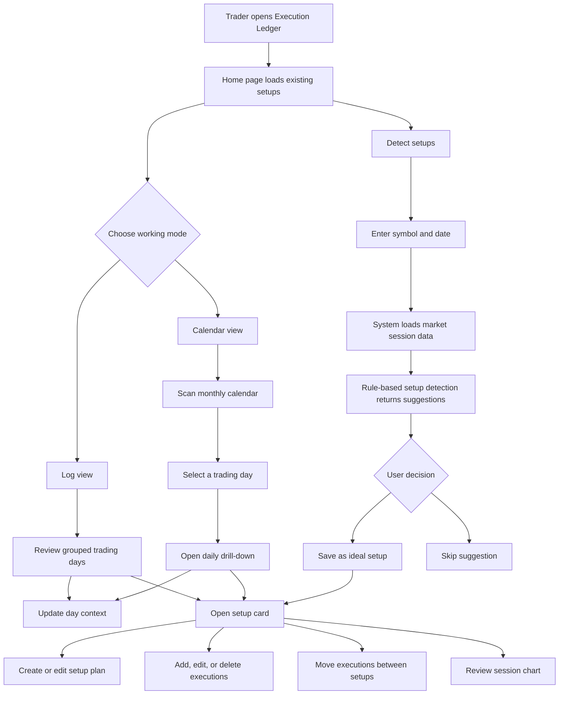
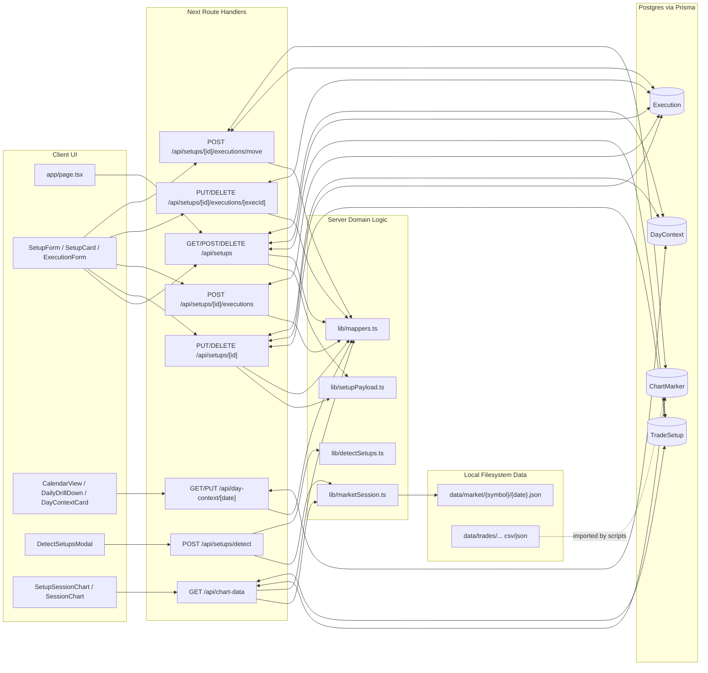
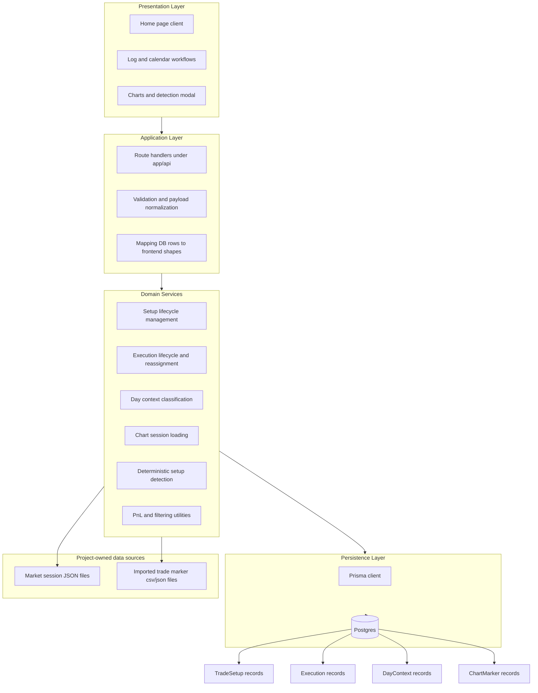

# Execution Ledger Diagrams

These diagrams describe the current implementation in this repository as of April 30, 2026.

## User Flow

## Data Flow

## Architecture

## Notes

- The main source of truth for journaled data is Postgres through Prisma.
- Chart rendering and setup detection also depend on session files under `data/market/`.
- Imported broker marker data is linked back to `Execution` and `TradeSetup` through `ChartMarker`.
- Setup detection is rule-based, not ML-based, and only writes data after user confirmation.
